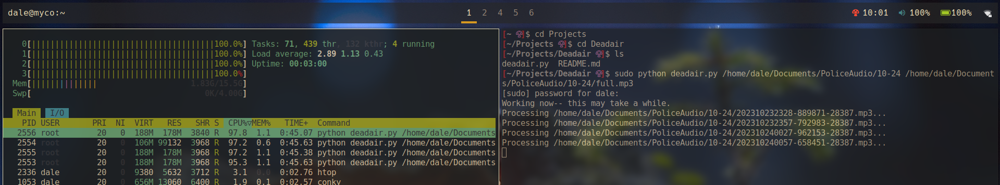

# deadair.py - batch silence remover for mp3s
## About:
I'm doing research for a project that involves thousands of hours of radio communications downloaded from Broadcastify archives, which are divided into 30 minute mp3s. To make it easier on myself I wrote a script to remove the silence and concatenate the mp3s into a single output file. So each day's audio goes into its own directory, and then the script spits out a clean, short file for the whole day. Unfortunately, that script sucked because it only worked on one file at a time and would have taken hundreds of hours to process everything.

Enter `concurrent.futures` and the `ProcessPoolExecutor` class. It's a way around Python's Global Interpreter Lock to allow for CPU-bound parallelism. So, on the low end 4 core laptop I'm doing all this stuff on, it defaults to four workers instead of just the one I was using before. It also makes my computer hum.

## Before You Run:
This script uses [pydub](https://pypi.org/project/pydub/) to manipulate audio files.
For Arch you can [get it from the AUR](https://aur.archlinux.org/packages/python-pydub) or otherwise `pip install pydub`.

By default `min_silence_len=5000` is set to 5000ms (5 secoonds) but you can tune it to whatever floats your boat.

## Then:
`python deadair.py <input_directory> <output_file.mp3>`

Depending on the file size, quantity and amount of processing required this can still take a while.
